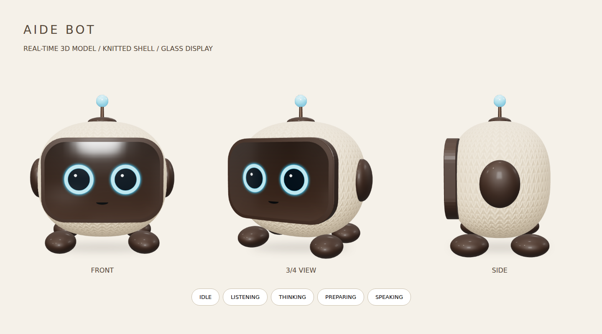

# AIDE Bot の3Dモデル

2026-09-06の会話で承認された、ベージュのニット外装・茶色の曲面ガラス・青いリング状の目・耳・4本の短い足・アンテナのデザインを立体化した。

## 編集する場所

- `src/components/voice/robot-3d/model.ts`: 形状、材質、顔、5状態の動き。実行時にモデルを構築するため、外部のモデル配信や画像生成APIは不要。
- `src/components/voice/robot-3d/scene.ts`: カメラ、照明、環境反射、描画のライフサイクル。
- `src/components/voice/robot.tsx`: 現行のPropsを維持する入口。SVGは読み込み中・GPU非対応・コンテキスト喪失時に使う。

表示は会話状態を受け取るだけで、マイクや音声の処理を呼ばない。音声準備中は点を暖色にし、思考中と区別する。発話時の口は状態に合わせた周期運動で、音素や実際の音量とは同期していない。

## 端末負荷

30fps上限、devicePixelRatioは端末の値どおり（最大3）。画面外・非表示タブでは描画を止め、動きを減らす設定では状態更新時に静止画を描く。編み目は小さな繰り返し凹凸テクスチャで表現する。描画終了時はGPU資源・observer・イベントを解放する。

上限は#190まで1.5だったが、DPR 3のiPhoneでは168pxの表示を252×252で描いて2倍に引き伸ばすことになり、輪郭と目がぼやけて見えた。等倍で描くと塗る画素は約4倍（252²→504²）になるが、三角形数・描画呼び出し・30fps上限・画面外での停止は変わらない。

## 確認項目

- 5状態と、聞き取り中のreacting
- 正面・斜め・側面の形状、168pxと200pxの表示、明暗背景
- 3D初期化失敗時とWebGLコンテキスト喪失時のSVG表示
- 非表示・再表示、サイズ変更、動きを減らす設定、mount/unmount
- `pnpm lint`、`pnpm typecheck`、`pnpm build:ci`

参考画像は完成方向を示すコンセプトで、リアルタイム描画のピクセル単位の一致を保証するものではない。iPhone実機の描画性能と音声の併用は別途実機で確認する。

## 成果物と検証結果

- `aide-bot.glb`: 待機時のモデルを同じ生成コードから書き出した静的スナップショット。形状と色・法線テクスチャを含む。アニメーションはアプリのコードで制御するため、このGLBにはベイクしていない。
- `robot-3d-preview.png`: 画像生成ではなく、モデルをブラウザで実際に描いた正面・斜め・側面。
- 実測: 1体あたり52,300三角形、13描画呼び出し。GLBは約592KB。数値はデスクトップ相当の検証用描画で、スマホ実機の速度を保証しない。
- コード全体のESLint、TypeScript、本番向けNext.jsビルドを確認。
- 実際の描画モジュールで5状態・reacting・動きを減らす設定・リサイズ・再マウント・WebGLコンテキスト喪失・資源解放を確認。JavaScriptエラーなし。
- 本番サイトやデータベースへの変更は行っていない。開発サーバーの起動はこの環境のNext.jsロック判定で失敗したため、音声画面全体のE2E確認は未実施。

